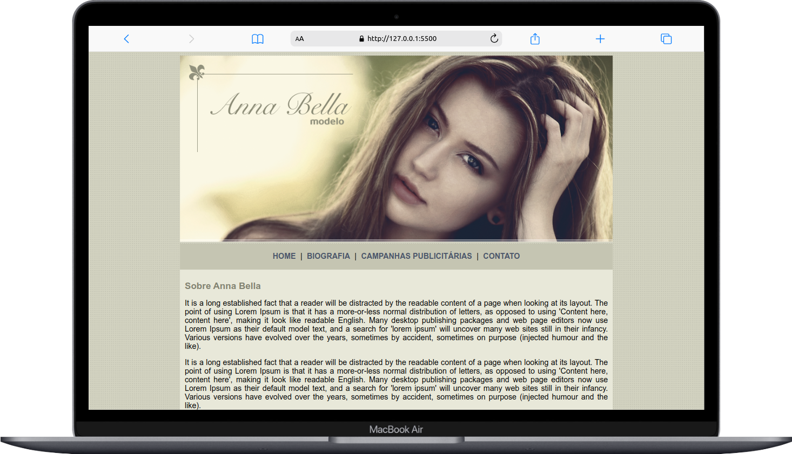

# Projeto-Anna-Bella 

## Sobre

O projeto é pagina simples de apresentação de uma modelo fictícia. Usa como base HTML e CSS.

Segue abaixo uma prévia da aplicação.

<h2 align="center">Preview</h2>

	

## Como executar esta aplicação?

Para rodar a aplicação voce deve:
- Primeiro clonar este repositório
- Navegar para a pasta `Projeto-Anna-Bella`
- Pode utilizar a extensão Live Server do Visual Studio Code para abrir o projeto ou utilizar o seu navegador para abrir o arquivo `index.html` 